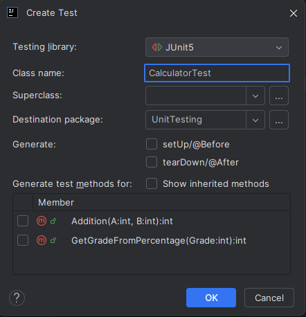

# Unit Testing in Java

## Create Unit Test Class
* Right-click in the file where your functions are located and click on “Generate” and then on “Test...”
* Now a popup window opens in which you can select your desired library (in this case: JUnit5). Enter a suitable class name and press ok.
* A new class has now been created and you can declare test functions using @Test and write the test functions.

### Instruction Image

## Run all Tests

## Results

## Run all Tests with Code Coverage

## Results

